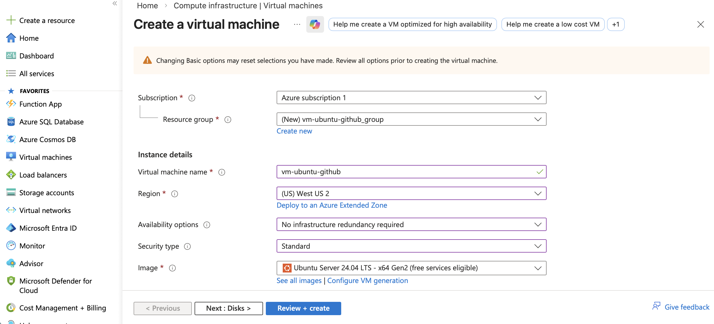
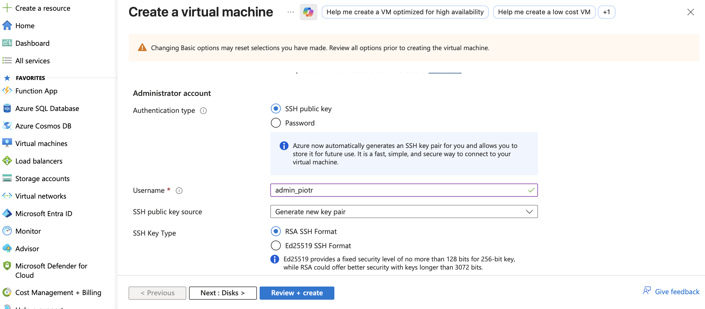
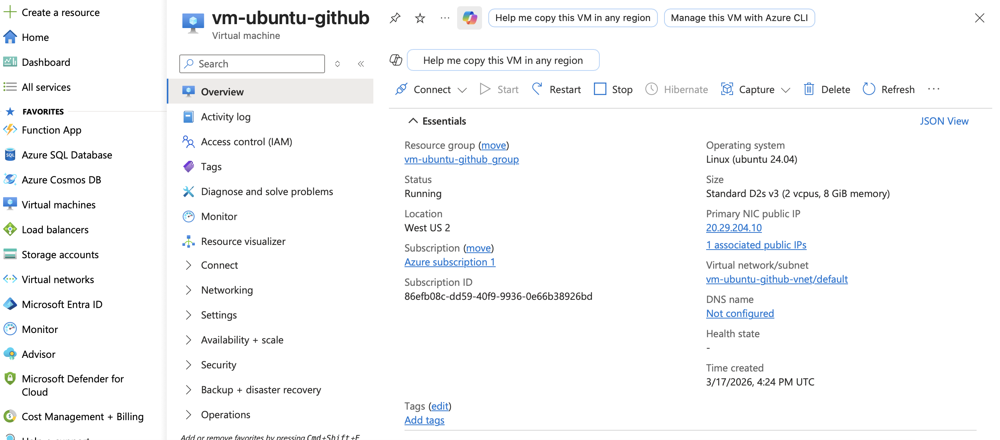
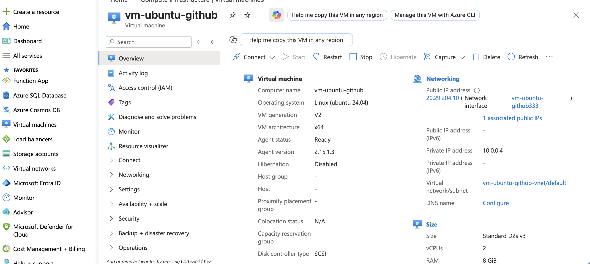
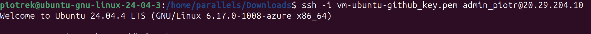
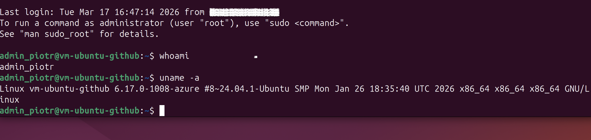

# 🚀 Project 
First Azure Virtual Machine

## 📌 Description
This project demonstrates the creation and basic configuration of my first Virtual Machine in Microsoft Azure

## 🛠️ What I did
- Created VM in Azure
- Configured networking and public IP
- Connected via SSH

## ⚙️ Technologies
- Microsoft Azure
- Ubuntu Linux
- SSH

## 📸 Screenshots

### Creating the Virtual Machine

### Azure VM Overview

### SSH Connection

## 💡 What I learned
- How to create and configure a VM in Azure
- Basics of Azure networking and public IP
- Secure remote connection via SSH
- Best practices in organizing Azure projects
